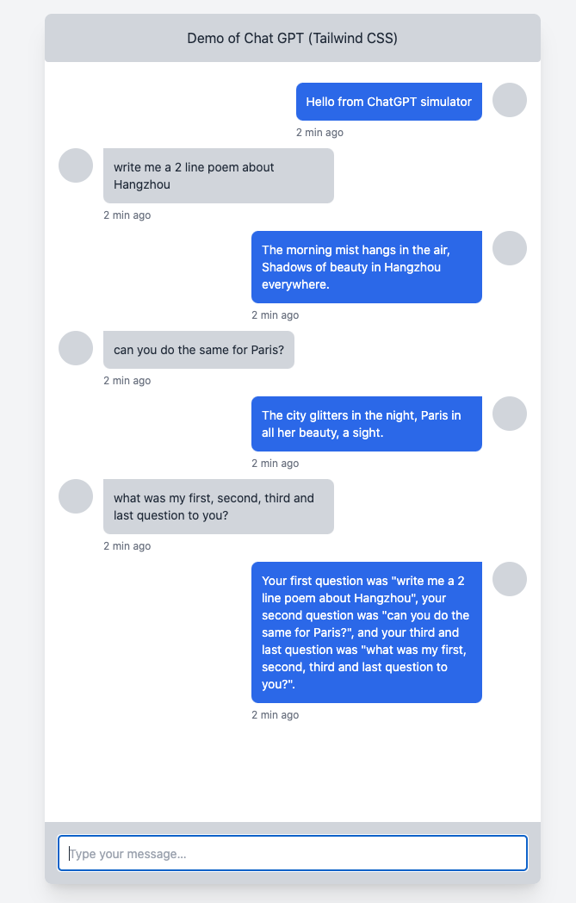

# nextjs-chatgpt-starter

Nextjs frontend starter kit for connecting to API at https://github.com/telus/node-chatgpt-starter

## WARNING about usage

This starter kit was created for the purpose of the 2023 ChatGPT Hackathon. For this reason:

- Do `NOT` deploy this using Telus infrastructure. Suggested options:

  - deploy locally on your local machine for development and demo purposes

- Do `NOT` feed it any Telus data, especially customer information. This includes but is not limited to DNTL, team member information, propietary data. Suggestion:
  - use publicly-available data
  - use mock/imaginary scenarios and conversations

## Screenshot



To get started:

```bash
# first, spin up a compatible API server at localhost:4000
# you can follow the instructions at https://github.com/telus/node-chatgpt-starter
# or edit `./pages/api/chatgpt.js` to make a different http request or communicate with a different service

git clone git@github.com:telus/nextjs-chatgpt-starter.git
npm install
npm run dev

```

Guides:

- https://beta.nextjs.org/docs
- https://beta.nextjs.org/docs/styling/tailwind-css
- https://freefrontend.com/tailwind-chats/
- https://nextjs.org/docs/guides/building-forms
- https://beta.reactjs.org/learn/scaling-up-with-reducer-and-context
